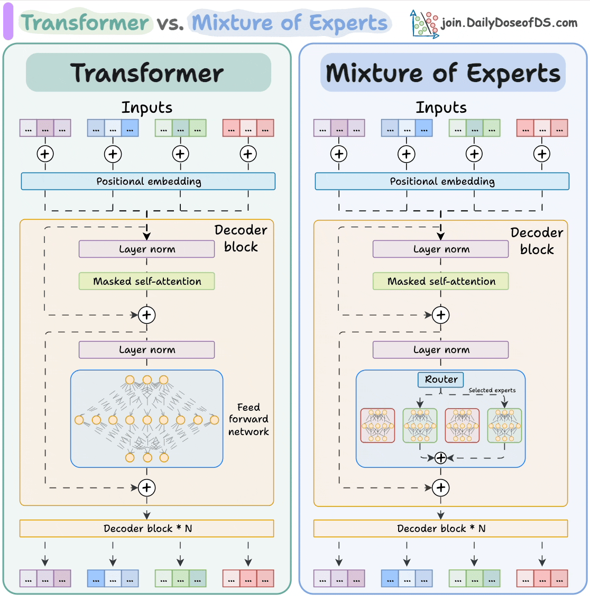
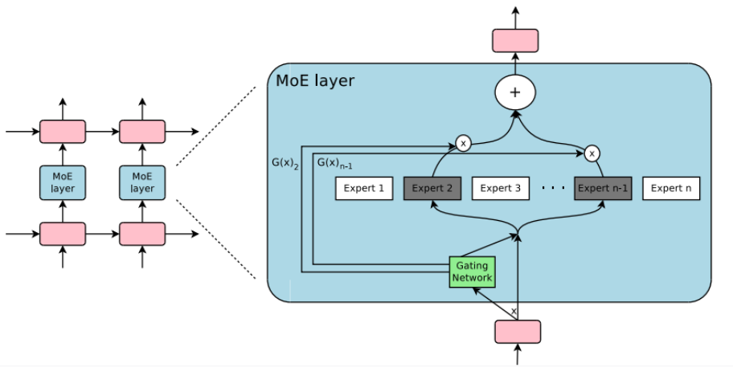

# MoE Transformer from Scratch

A PyTorch implementation of a Mixture of Experts (MoE) based Transformer model built from scratch and trained on multilingual text data.

## 🚀 Overview

This project implements a **Mixture of Experts (MoE) Transformer** model from the ground up using PyTorch. The MoE architecture introduces sparsity by using multiple expert networks within each transformer layer, with a gating mechanism that dynamically routes tokens to the most relevant experts. This allows for efficient scaling of model capacity without proportional increases in computational cost.

### Key Features

- **Custom MoE Implementation**: Built-from-scratch MoE layers with learnable routing
- **Transformer Architecture**: Complete transformer model with attention mechanisms
- **Multilingual Training**: Trained on the Helsinki-NLP opus_books dataset
- **Educational Focus**: Clean, well-documented code for learning purposes

## 📊 Dataset

**Helsinki-NLP/opus_books**
- **Languages**: 16 languages (ca, de, el, en, eo, es, fi, fr, hu, it, nl, no, pl, pt, ru, sv)
- **Size**: 19.50M tokens, 0.91M sentence fragments
- **Content**: Collection of copyright-free books manually aligned for translation
- **Use Case**: Machine translation and multilingual NLP tasks

🔗 [Dataset on Hugging Face](https://huggingface.co/datasets/Helsinki-NLP/opus_books)

## 🏗️ Architecture
   ### Transfomer Vs MoE Transfomer
   The model implements a standard transformer architecture with MoE layers replacing traditional feed-forward networks:
   
   

   
   ### MoE Architecture
   
   
   
   - **MoE Layers**: Multiple expert networks with sparse activation
   - **Gating Network**: Learned routing mechanism to select relevant experts
   - **Shared Parameters**: Attention layers shared across all experts
   - **Dynamic Routing**: Token-level expert selection for optimal performance

## 📁 Project Structure

```
MoE_Transformer_from_Scratch/
├── MoE_Transformer_from_Scratch.ipynb    # Main implementation notebook
└── README.md                             # Project documentation
```

## 🛠️ Installation

1. **Clone the repository**
   ```bash
   git clone https://github.com/KartikGarg20526/MoE_Transformer_from_Scratch.git
   cd MoE_Transformer_from_Scratch
   ```

2. **Install dependencies**
   ```bash
   pip install torch datasets tokenizers tqdm torchmetrics tensorboard
   ```

3. **Additional requirements** (if using GPU)
   ```bash
   # For CUDA support
   pip install torch --index-url https://download.pytorch.org/whl/cu121
   ```

## 🚀 Usage

### Quick Start

1. **Open the notebook**
   ```bash
   jupyter notebook MoE_Transformer_from_Scratch.ipynb
   ```
   
   Or use Google Colab: [](https://colab.research.google.com/github/KartikGarg20526/MoE_Transformer_from_Scratch/blob/main/MoE_Transformer_from_Scratch.ipynb)

2. **Run all cells** to:
   - Load and preprocess the opus_books dataset
   - Initialize the MoE Transformer model
   - Train the model on selected language pairs
   - Evaluate model performance

### Training Process

The notebook covers:
- Data loading and preprocessing
- Model architecture definition
- Training loop implementation
- Loss computation and optimization
- Model evaluation and inference

## 🎯 Model Components

### MoE Layer
- **Experts**: Independent feed-forward networks
- **Router**: Gating network for expert selection
- **Load Balancing**: Ensures efficient expert utilization

### Transformer Components
- **Multi-Head Attention**: Standard attention mechanism
- **Layer Normalization**: Stabilizes training
- **Positional Encoding**: Handles sequence order

## 📈 Evaluation

The model was evaluated using common machine translation metrics implemented with torchmetrics:

- **Character Error Rate (CER)**:
   Measures the proportion of character-level insertions, deletions, and substitutions needed to match the predicted output with the reference.
   Lower CER indicates better performance.

- **Word Error Rate (WER)**:
   Similar to CER but at the word level. Commonly used in speech recognition and translation tasks.
   Lower WER indicates better performance.

- **BLEU Score**:
   Evaluates translation quality by comparing n-grams of the predicted output with reference sentences.
   Higher BLEU indicates better alignment with ground truth translations.

> ⚠️ **Note**: Due to limited GPU resources, I was only able to train the model for 5 epochs on Google Colab’s free GPU. This project is mainly intended for **educational purposes and demonstration of MoE implementation** rather than achieving state-of-the-art performance.

## 📚 References

- [Attention Is All You Need](https://arxiv.org/abs/1706.03762) - Original Transformer paper
- [OUTRAGEOUSLY LARGE NEURAL NETWORKS: THE SPARSELY-GATED MIXTURE-OF-EXPERTS LAYER](https://arxiv.org/pdf/1701.06538) - Sparse Mixture of Experts
- [Helsinki-NLP OPUS Project](http://opus.nlpl.eu/) - Dataset source
